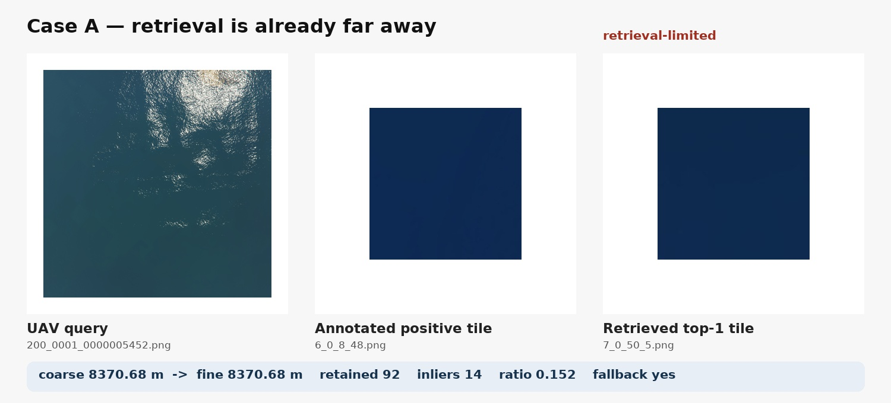
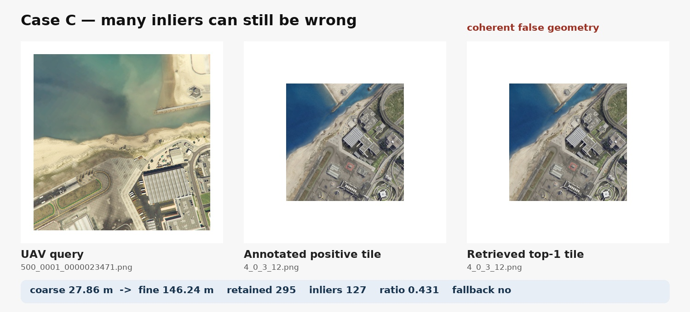
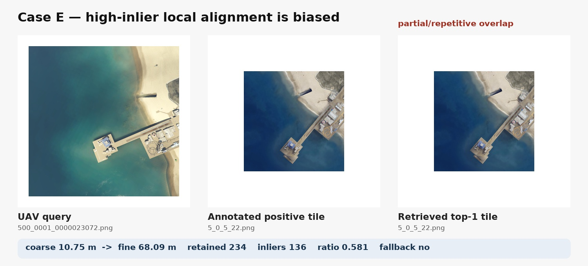

# GTA-UAV：算法不工作或精度较差的典型情况

两个风险：

- **上游限制**：约 9.35% 的样本中，top-1 中心误差已经超过 200 m。若真实区域不在 tile 的有效重叠范围内，后处理无法“凭空找回”位置。
- **下游破坏**：11.91% 的样本经过细定位后反而更差。这说明当前几何接受条件仍不能完全识别“看起来匹配得不错、实际投影错误”的情况。

云南拍摄数据集：

## 3. 失败类型总结

> 说明：下列 coarse/fine 误差和 retained/inliers 来自原 `SP+LG+VOP` 正式日志；按展示要求，3.2 和 3.3 的连线图改为相同图像对上的 `dense DKM, no rotate` 对照结果，两者不是同一次 matcher 输出。

### 3.1 检索 top-1 严重错误：细定位没有可恢复的重叠

### 3.2 内点很多，几何仍然可能是错的

- coarse 误差：27.86 m
- 细定位误差：146.24 m
- retained / inliers：295 / 127
- 内点率：0.431

**Dense DKM 匹配效果：**

- 匹配器：dense DKM，no rotate
- 完整输出约 5000 个稠密采样对应；图中均匀抽取 320 条，避免连线完全遮挡图像
- 绿色连线：RANSAC 判定的内点
- 红色连线：未被最终单应性支持的外点

图中可以看到，DKM 在海岸、道路和建筑等强结构上给出了非常密集且内部一致的对应。Dense matcher 能显著提高对应覆盖度，但“对应非常密集”本身仍不能直接证明最终地理投影正确。

图中包含海岸线、道路、建筑边缘等强结构。大量局部对应可以形成内部一致的单应性，但该单应性不一定把卫星块中心投到无人机真实位置。

**为何精度差：**

- 无人机视野只覆盖卫星 tile 的局部区域；
- 强线条或相似结构可形成一致但有偏的对应；
- 当前候选选择主要依赖内点数量和内点率，无法直接判断最终地理投影是否正确。

### 3.3 局部结构高度一致，但定位点存在系统偏置

- coarse 误差：10.75 m
- 细定位误差：68.09 m
- retained / inliers：234 / 136
- 内点率：0.581

**Dense DKM 匹配效果：**

- 匹配器：dense DKM，no rotate
- 完整输出约 5000 个稠密采样对应；图中均匀抽取 320 条
- 绿色连线：RANSAC 判定的内点
- 红色连线：未被最终单应性支持的外点

该图进一步说明：dense DKM 可以在局部结构上形成稳定、广泛的对应，但用于定位的卫星 tile 中心可能远离局部约束最强的位置。局部单应性“拟合得好”，并不自动保证中心投影准确。

这是比“少匹配点”更难检测的失败：内点数量和比例都很高，常规阈值会认为几何可靠。

**可能原因：**

- 重复道路、屋顶或规则纹理产生局部一致匹配；
- 单应性拟合的是局部可见平面，而最终投影使用的是整张 tile 的中心；
- 无人机图与卫星图存在视角、遮挡和尺度差异，局部对齐正确不代表中心投影正确。

**可展示结论：** 仅增加 keypoint 或放宽匹配阈值不能解决这类问题。

##  归纳：在哪些场景容易不 work

| 场景条件 | 主要症状 | 当前系统为何难处理 |
|---|---|---|
| 查询位于 tile 边缘、重叠很小 | 少量内点，投影漂移 | 单应性对局部噪声敏感 |
| 大面积水面、空地、低纹理区域 | 匹配稀少或集中在局部 | 几何约束覆盖范围不足 |
| 道路、屋顶、岸线等重复强结构 | 内点很多但位置错误 | 产生内部一致的假几何 |
| UAV 与卫星视角/尺度差异较大 | 局部对齐但中心投影有偏 | 单一平面单应性近似不充分 |

